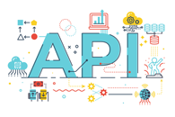

# Coding Challenge 28 💻 LANGO - The Complete Dev Language API

As a community we are going to build an API! Lango aims to be the the complete development language API. A simple yet extensive HTTP API, providing its users with the ability to request both:

-   Generalised data about their desired language, framework or standard.
-   Specific language feature, for example: requesting information and examples on JavaScript Functions.

## Motivation

The motivation behind this project is not only to provide a project that creates a learning opportunity in the technologies and stack used to create APIs and populating the data within the project, but also to become a final product that will be useful to developers and student alike when creating their applications/websites.

## Code Style

We are using Prettier to create a uniformed code base that is easy to read for everyone. If you do not have Prettier set up in you editor, follow the advice set out [this video](https://www.youtube.com/watch?v=h3PJjP0nE98), ensuring that you have the `Format on save` option enabled.

If you are using an editor other than Visual Studio code, do a quick google for your editor. If you are still stuck, ask for advice in our Discord!

## Tech Stack

-   Node
-   Express
-   Handlebars
-   Jest

## Features

-   Lango should have beginner friendly documentation
-   Lango should support for the various language in the programming and development world
-   Lango should have a endpoint for searching general details and statistics for the requested language
-   Lango should have a endpoint for looking up information and examples for the specified element of the language
-   Lango should have a endpoint for requesting details about specified language standards, such as ECMASCRIPT

## Getting Started / Installation

To get started with this project, be sure to check out the Trello board [here](https://trello.com/invite/b/a6HV2wni/719405fe166fb668f02f84a4f4943869/web-dev-api), to pick up your next challenge. If you have any questions on getting started, ask in the [#coding-challenge channel](https://discordapp.com/channels/423464391791476747/434849407054381096/716684388028383272) in discord

#### Installing and Setup

1. ❗ **Fork this repo to your Github account**
2. Clone **your fork** to you local machine
3. Open the project in your favourite code editor
4. Run `npm install`

## Tests

To be updated

## Looking for more challenges?

We highly recommend checking out the back catalogue of [coding challenges](https://zerotomastery.io/community/coding-challenges/?utm_source=github&utm_medium=coding_challenge-28). With varying levels of complexity there is something to test and push every skill level.

## One Last Thing!

**Please note: As with all my challenges there is zero benefit or monetary gain I receive from it. This is just my way of thanking my students and making sure that you are able to continue gaining valuable knowledge outside of just my videos. It would mean a lot to me if you are able to rate my course...5 star reviews make my day :)**
